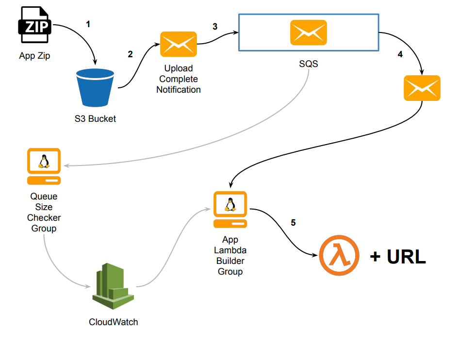

# Auto-Lambda

## What is this?
An outline for a proposed AWS pipeline. The pipeline is meant to take app zips
and automatically deploy them as AWS Lambda functions.

## Why a whole pipeline? Why not simply spin-up a single worker in Heroku or DO?
That was the initial solution, and eventually the adopted solution, however it
originally was scrapped due to design miscommunication.

## Takeaways?
  1. became familiar with the AWS ecosystem/tools
  2. learned the importance of effective communication and
  3. recognized the power of good/simple visualizations

## So why outline a scrapped solution?
This information may be useful in the future; why throw away hard work when you
can quickly outline/document it and archive it.

## So what does this pipeline look like?

### Deployment Flow(black line):
  1. The zipped app code is uploaded to an S3 bucket.
  2. Upon upload completion, an S3 event is triggered resulting in an auto-
  generated message. This message contains the zip path, among other things.
  3. The message is placed onto an SQS message queue.
  4. The message is then picked off the queue by a worker inside of an auto-
  scaling group.
  5. Workers in this group run a custom AMI which uses a combination
  of the Amazon linux OS(in order to [build native dependencies][1]), bash
  scripts and [chalice][2] (or [zappa][3]) to create and
  deploy a lambda function for the app zip.

### Scaling Metric Flow(grey line):
We want to use the queue size as our target scaling metric for the worker group
(i.e. App Lambda Builder Group).

By default, cloudwatch tracks the queue size as a metric which is updated every
5 minutes. In order to increase the update frequency, we need to create a custom
cloudwatch metric which uses a checker instance as its source (i.e. a small ec2
whose sole purpose is to poll the queue size at some specified frequency); this is
the official AWS solution as outlined in [Rapid Auto Scaling with Amazon SQS][4].

[1]: https://medium.freecodecamp.org/escaping-lambda-function-hell-using-docker-40b187ec1e48
[2]: https://github.com/aws/chalice
[3]: https://github.com/Miserlou/Zappa
[4]: https://aws.amazon.com/blogs/aws/auto-scaling-with-sqs/
